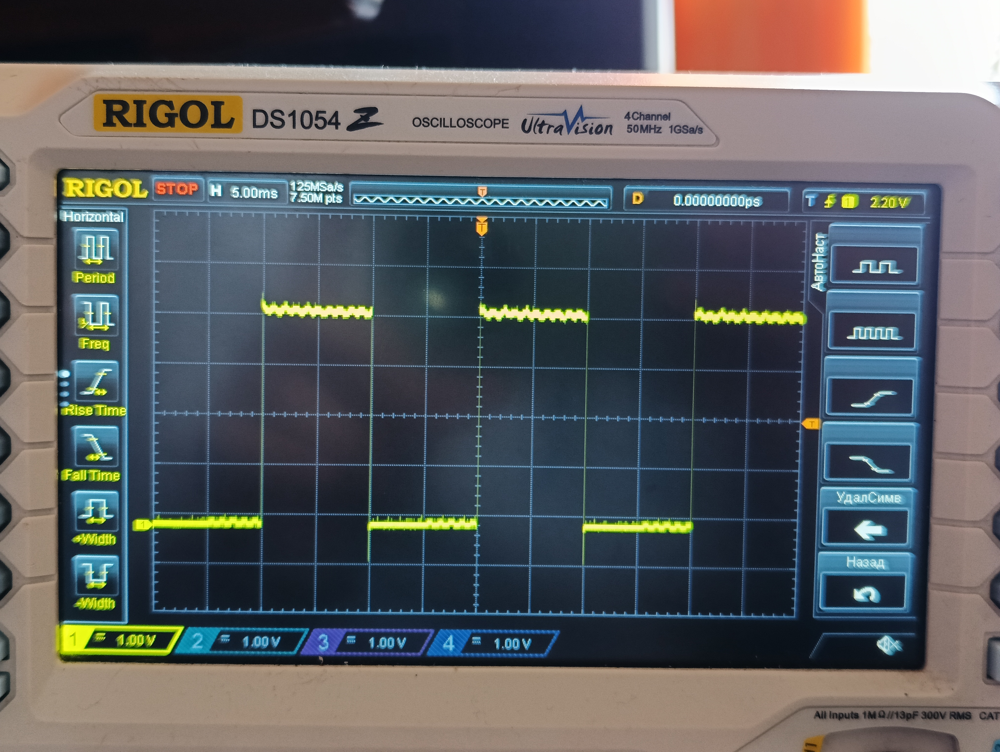
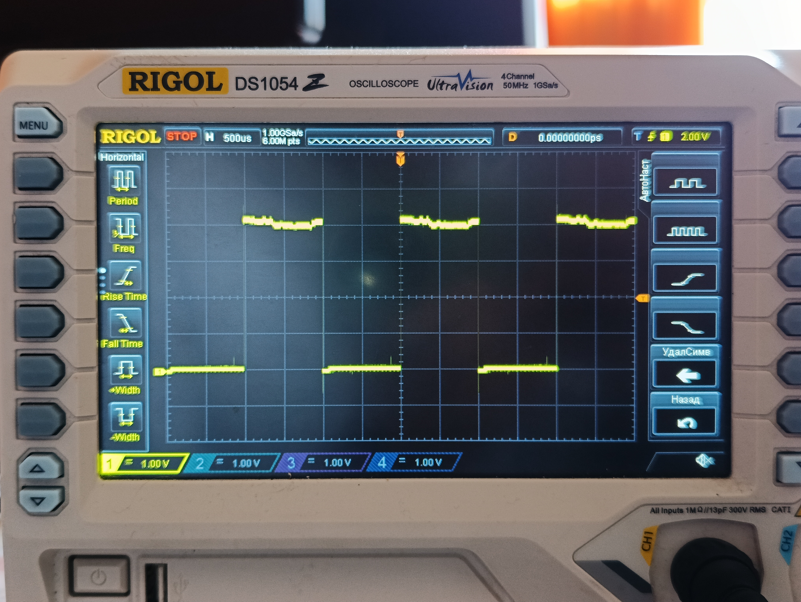
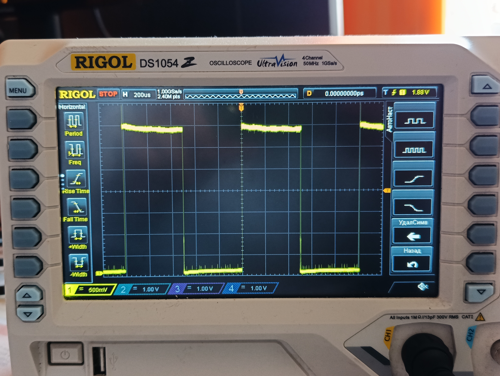
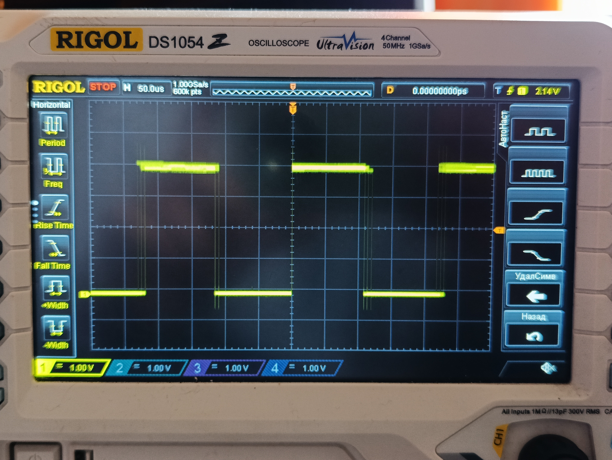
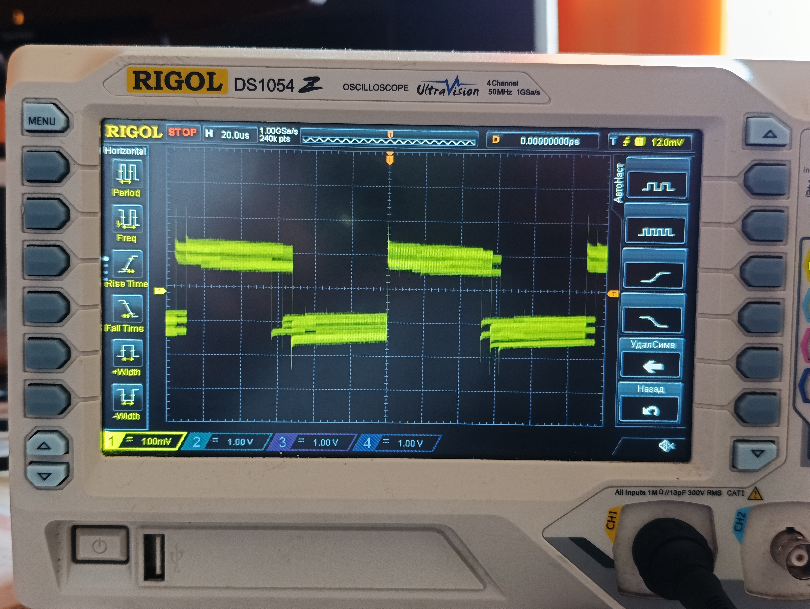

# Задание №1

## Цель

Освоить аппаратано-программный инструментарий на базе платы Arduino UNO:
* сборка и прошивка в Arduino IDE;
* отладка прошивки с помощью осциллографа.

## Задача

Реализовать приложение (прошивку) для платы Arduino UNO, осуществляющую генерацию одновременно пяти импульсов со скважностью 50%:
- 3 ножка - 10 мс.
- 5 ножка - 1 мс.
- 6 ножка - 500 мкс.
- 9 ножка - 100 мкс.
- 10 ножка - 50 мкс.

## Результаты для Uno R3 (digitalWrite)

| Длительность | Осциллограмма |
|:------------:| :------------: |
|10 мс|  |
|1 мс|  |
|500 мкс|  |
|100 мкс|  |
|50 мкс|  |
