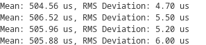

# Задание №2

## Задача
Hеализовать прием/передачу между двумя платами Arduino, позволяющий в консоли увидеть мат.ожидание и среднеквадратичное отклонение длины импульсов за определенное период(рассчитываем метрики например для 100 подряд импульсов).

## Результаты

| Длительность | Uno R3 (digitalWrite) | Uno R3 (оптимиз.) | Uno R4 | 
|:------------:| :------------: | :------------: | :------------: |
|10 мс|  |  |  |
|1 мс|  |  |  |
|500 мкс|  |  |  |
|100 мкс|  |  |  |
|50 мкс|  |  |  |