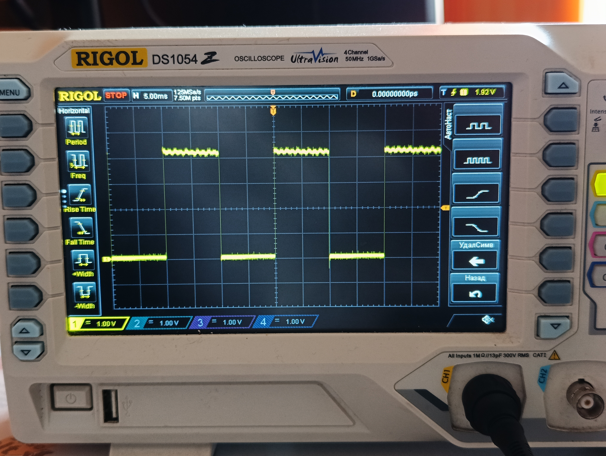
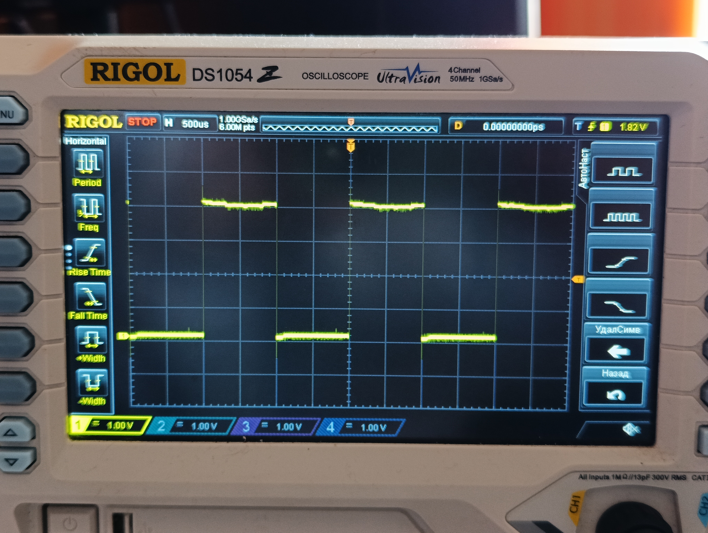
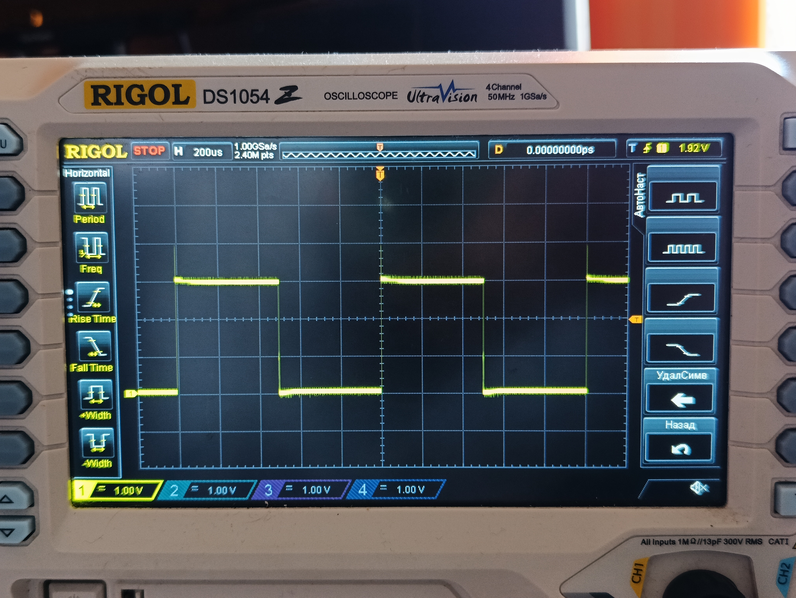
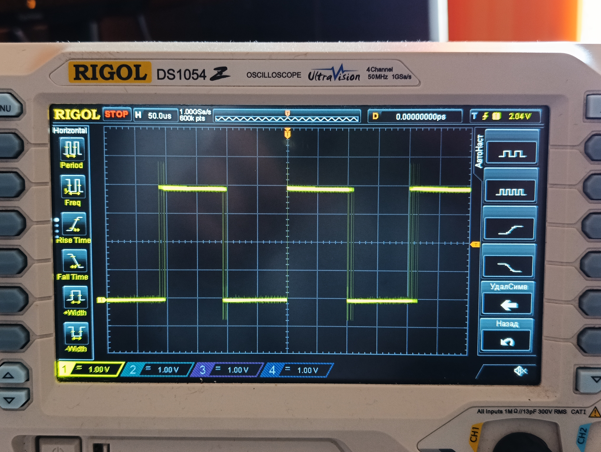
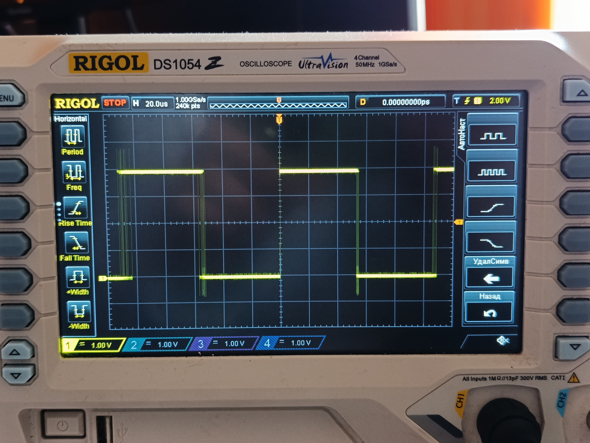
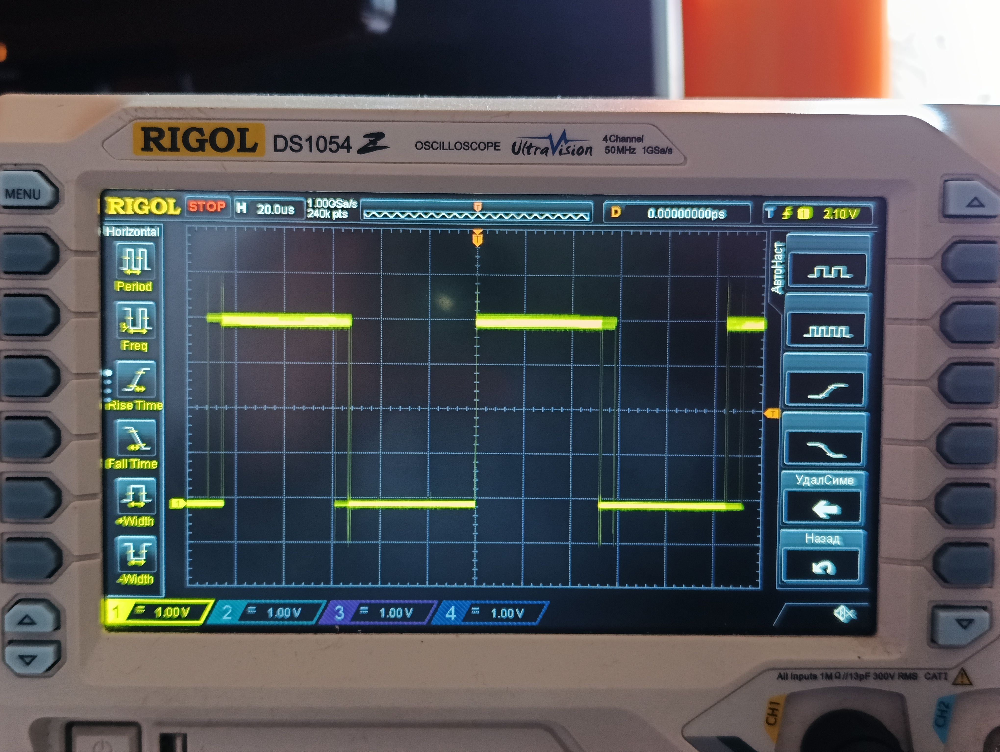

# Задание №3

## Результаты для Uno R4

| Длительность | Осциллограмма |
|:------------:| :------------: |
|10 мс|  |
|1 мс|  |
|500 мкс|  |
|100 мкс|  |
|50 мкс|  |

## Результат для Uno R3 (оптимиз.) на 50 мкс
